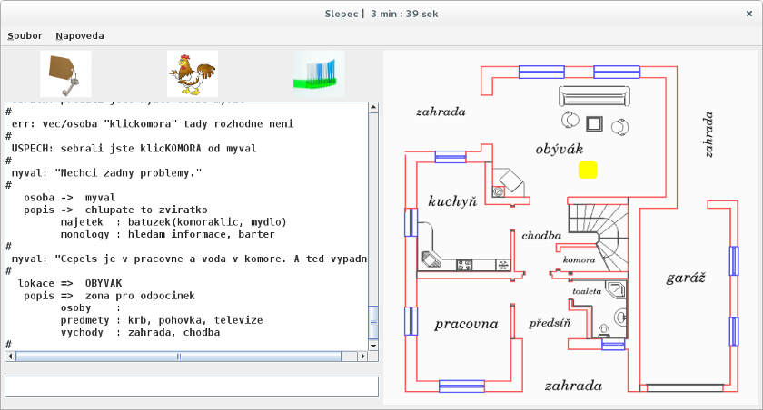

# game

* graphics mode (GUI) `java -jar game.jar`
* text mode (CLI) `java -jar game.jar text`

### game commands

```
  batoh  /your backpack
    jdi  /go <room>
    jez  /eat <what>
kdejsem  /current room
  konec  /exit game
   mluv  /talk <to sb> [about sth]
napovez  /help
odemkni  /unlock <room>
    pij  /drink <what>
  poloz  /put <what> [where/who]
  popis  /get detail <what/who>
   save  /save game
  seber  /grab <what> [where/who]
 zamkni  /lock <room>
 ```

## [DOWNLOAD](https://github.com/paveljurca/game/tree/master/download)



(c) 2013 Pavel Jurca, [University of Economics in Prague](https://isis.vse.cz/katalog/syllabus.pl?predmet=82362;typ=1;jazyk=3;vystup=1;lang=en)
